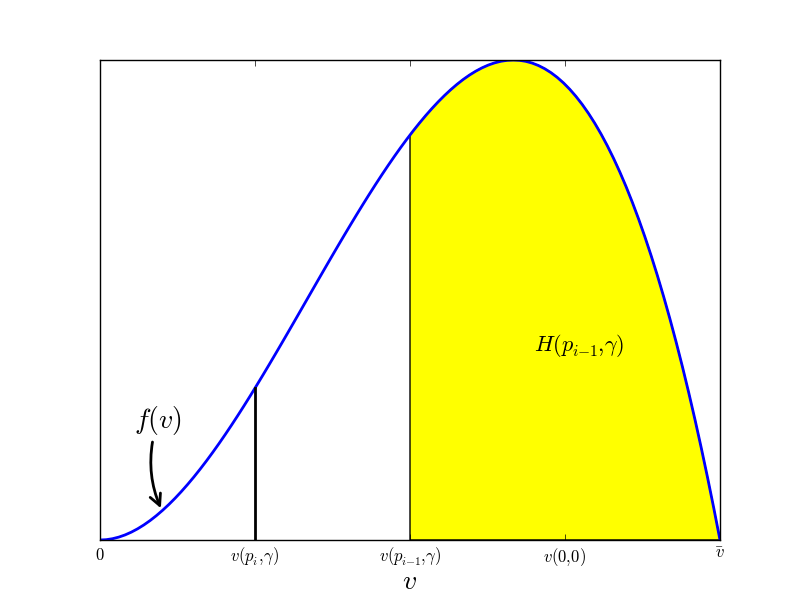

% Capitation and provider choice
% Jan Boone
% Tilec, Tilburg University

Introduction
============

motivation
----------

- bigger provider networks lead to higher health care expenditure

    - cross section studies
    - AWP laws
    - US: fee-for-service; narrow networks; broader networks

- both price effect and utilization effect of selective
  contracting/managed care

    - Cutler et al (2000): price
    - papers by Zwanziger and co-authors (1988, 1994, 1996): utilization and cost
    - Chernew et al. (2008): utilization
    - Chernew and Newhouse (2011): overview of effects on expenditure and
    costs

- we focus on the effect of network size on utilization and costs

policy problem
--------------

- is it a problem that bigger networks lead to higher costs?
- often presented as a trade off between patient choice and efficiency
- but insurer should be able to resolve this efficiently?
- why should more choice lead to higher utilization?
- people worry that narrow network leads to under-treatment (NYT, July
  2014; LA Times Sept. 2013)
- why should insurer want to induce under-treatment?

private contracts
-----------------

- with public contracts there is no effect of network size on
utilization and costs
- cannot address concerns on under-treatment
- contracts are private in reality

    - confidentiality clauses (Muir et al., 2013)
    - only insurer and provider know the terms
    - other insurers and providers do not
    - consumers do not

- details of these contracts are payoff relevant

questions
---------

- capitation fee as supply side cost sharing
    - how is this combined with provider choice?
    - why is demand side cost sharing used?
- higher fee-for-service makes provider more willing to treat
    - how can this be signalled to insured?
    - what are effects of price transparency and AWP laws?

literature
----------

- health economics literature on selective contracting and managed
care

- papers by McGuire and co-authors (1993, 1997, 2002) on physician
agency
    - with public contracts demand and supply side cost sharing
    separated
	- optimal to have no demand side cost sharing

- I.O. literature on private contracts
    - Hart and Tirole (1990): upstream monopolist with two downstream
    firms cannot earn monopoly profit with two part tariff
	- $p>c$: oversupply because downstream firms expect U to oversell to
    competitor
	- in our case: $p<c$: provider expects too many
      patients 

main results
------------

- with private contracts, supply side cost sharing decreases in
  network size 
- strategic effect: given capitation fee, insurer sends too many
patients to provider with lowest $p$
- needs to be compensated by higher capitation
- optimal network size trades off treatment efficiency against provider
profits
- demand side cost sharing to reduce over-treatment

Model
=====

insurers
--------

- risk neutral
- risk averse consumers (mass 1)
- premium $\sigma$
- co-payment $\gamma$ in case of treatment
- network size $n$ of homogeneous providers
- offer providers fee-for-service $p \geq 0$, capitation $t$
- no other cost of insurance
- perfect competition

providers
---------

- risk neutral
- $c$ cost of treatment
- $v \in [0,\bar v]$ value of treatment, $F$
- efficiency: treat iff $v \geq c$
- under-treatment: patients with $v > c$ are not treated

consumers
---------

- same exogenous probability $\theta$ that treatment is needed
- copay $\gamma >0$ inefficient due to risk aversion: $\delta(p,\gamma)$
- gets treatment iff $v \geq v(p,\gamma)$

	- efficiency: $v(p,\gamma) = c$
	- $v(p,\gamma) > c$: under-treatment
	- number of treatments $H(p,\gamma) = \theta (1-F(v(p,\gamma)))$
    - with $H_p \geq 0, H_{\gamma} \leq 0$

Public contracts
================

efficiency
----------

- contract $n$ providers
- fee-for-service: $p^*$ with $v(p^*,0) = c$
- assume $p^*<c$
- capitation: $t = H(p^*,0)(c-p^*)/n$
- network size has no effect on costs/utilization
- can be an effect on distribution of rents via $t$

other effects
-------------

- threat to exclude
- shifting volume
- taste for variety
- heterogeneous providers or agents
- risk averse providers

Private contracts
=================

truthful revelation
-------------------

- insurer can implicitly guide patients to providers
- send patients (first) to provider $i$ with lowest $p_i$
- different from explicit/contractible steering

    - exclude provider from network
	- vary $\gamma_i$ with provider $P_i$

- even without steering:

    - number of patients treated by $P_i$ depends on prices of other providers
	- patients not treated by $P_j$ shop around hoping that $v(p_i,\gamma) < v < v(p_j,\gamma)$

capitation
----------

- how many patients can $P_i$ expect?
- insurer tells $P_i$ that $P_j$ has contract with $p_j = p_i - \varepsilon$
- $P_i$ can expect to treat only $\hat x_i = H(p_i,\gamma) - H(p_i - \varepsilon,\gamma)$ patients
- $t_i$ close to 0
- set of contracts $p,t$ where $x_i$ is truthfully revealed:

$$
A_{\gamma,n} = \{ (p,\hat x (c-p)) |\hat x \geq
x\}
$$

proposition
-----------

- for each $(p,t) \in A_{\gamma,n}$, we have $t \geq H(p,\gamma)(c-p)$ 
    - each provider gets $t$ as if she has lowest $p$
    - any lower $t$ is rejected by providers
    - intuition: provider $P_i$ does not believe insurer's claim that there is $p_j < p_i$

profits
-------

- if two providers get offered the same $p<c$, insurer pays $t=H(p,\gamma)(c-p)$ to each
- total cost equal

$$
H(p,\gamma)p+2H(p,\gamma)(c-p)=H(p,\gamma)c+H(p,\gamma)(c-p) > H(p,\gamma)c
$$

- providers make a profit

---------

---------

- reduce provider profits by raising fee-for-service $p$ and reduce capitation $t$
- hence bigger networks lead to less supply side cost sharing
- and thus to higher health care utilization and costs
- with $n=2$, set $p_1=0,t_1=H(0,\gamma)c$ and

$$
C(n,\gamma) = \min_{p_2} H(0,\gamma)(c-\gamma) +
[H(p_2,\gamma)-H(0,\gamma)](p_2-\gamma)
$$
$$
+ H(p_2,\gamma)(c-p_2)
$$

intuition
---------

- as network size $n$ increases, supply side cost sharing becomes more expensive
- with $n=1$, reduce treatment costs by setting $p=0,t=H(0,\gamma)c$

    - insured cannot observe $p$
	- premium does not depend on $p$

- with $n \geq 2$, this becomes too expensive, as each provider requires $t=H(0,\gamma)c$
- raise $p$ to reduce $t$
- bigger network leads to more utilization and higher cost
- for $n$ big enough, $p=c$: indemnity insurance, all providers contracted
- size of the network signals probability of treatment

    - broader networks are more generous
	- premium depends on $n$

results
-------

- costs $C(n,\gamma)$ increase in $n$
- decrease in $\gamma$
- consumer is interested in highest price $p(n,\gamma)$
- probability that insured is treated (at all) is
$H(p(n,\gamma),\gamma)$
- probability of treatment increases with $n$

Insurance market
================

value of insurance
------------------

- Bertrand competition: $\sigma = C(n,\gamma)$
- consumer does not know $p_i$
- but does understand that bigger network leads to higher
$p(n,\gamma)$
- values insurance at

$$
V^i = \theta \int_{v(p(n,\gamma),\gamma)} (v-\gamma)f(v) dv - C(n,\gamma)-\theta
   \delta (p(n,\gamma),\gamma)
$$

efficiency
----------

- due to competition, insurers choose $n,\gamma$ to maximize $V^i$
- network size is trade off between number of treatments and
providers' profits
- inverse U between $n$ and profits

    - zero profits with $n=1$
    - zero profits with $n$ high enough that $p=c$

- if optimal $n$ implies over-treatment, $\gamma > 0$ can be optimal
- unlike public contracts, here both demand and supply side cost
sharing needed

Policy implications
===================

AWP laws
--------

- make it harder to exclude provider from the network
- with private contracts, providers have positive profits; want to be
part of the network
- with perfect competition in insurance market, $V^i$ is maximized
- if AWP laws lead to higher $n$, reduction in welfare

price transparency
------------------

- attempts by government to increase price transparency
- ensuring that insured know what prices they have to pay for
treatment

    - what is price for uninsured treatment?
    - what co-payment do insured pay?

- should there be transparency about prices paid by insurers to
providers?

------------

- "do it well or not at all"

    - if everyone knows these prices: public contracts
    - implement first best: $p^*<c,\gamma=0$
    - consumer buying insurance need to know prices for all possible
    treatments
    - more likely: insurers and providers know all prices but
    consumers do not
    - optimal to set $p=0$: under-treatment
    - signalling value of network size disappears
    - as $p=0$ is possible with private contracts as well, this type of
      price transparency reduces welfare

